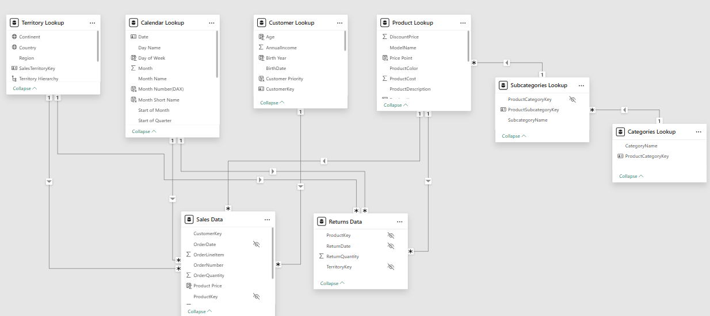
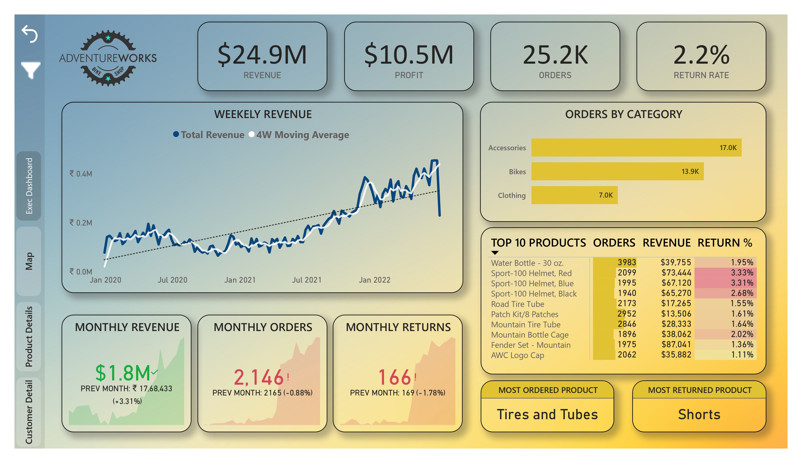
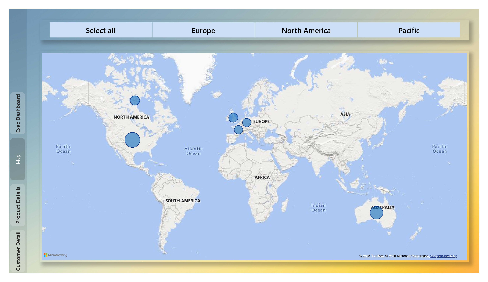
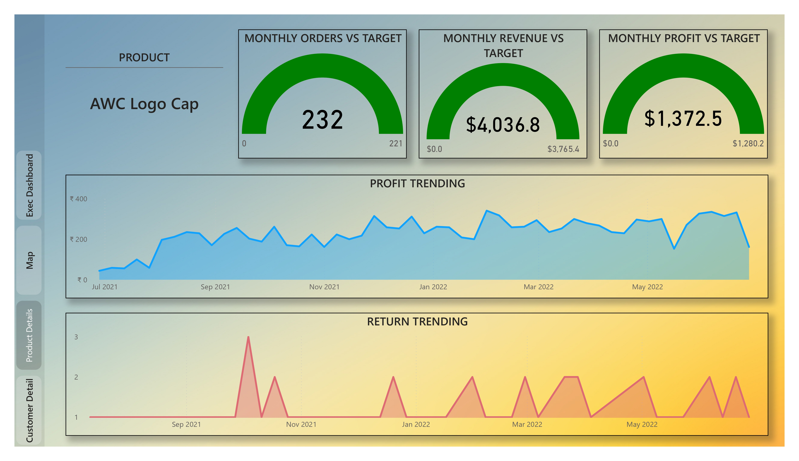
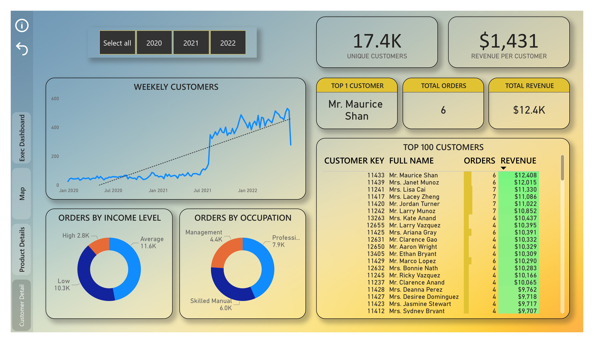
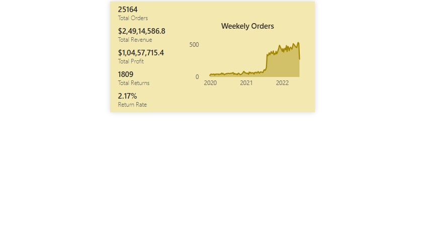

# POWER BI BUSINESS INSIGHTS DASHBOARD PROJECT

---

## Project Overview
This Power BI project follows a complete data analysis workflow; importing, cleaning, modeling, and visualizing business data to uncover actionable insights. It showcases strong skills in data transformation, DAX calculations, and interactive reporting to support informed decision-making.

---

## Data Preparation & ETL Process
This project follows a complete **ETL (Extract, Transform, Load) pipeline** to ensure clean, structured data for analysis in Power BI.

### Data Extraction - Loading Raw Data into Power Query
- **Imported CSV files & folder-based data** into query editor
- **Combined multiple files** into structured tables

### Data Transformation - Cleaning the Data
- **Removed erorrs and empty rows** to ensure data accuracy
- **Eliminated duplicates and handled missing values** to maintain data integrity
- **Standardized column names & data types** for consistency across tables
- **Applied transformation steps**, including splitting/merging columns, formatting values, and extracting needed information
- **Created many new calculated columns** to enhance analysis
-  **Built a Calendar Table** with calculated columns (Week, Month, Year, Start of Year, Start of Quarter) for time-based analysis

### Data Loading - Loading Data to BI Front-end
- **Loaded cleaned and transformed data** from Power Query into Power BI
- **Ensured data structure compatibility** for smooth report building

---

## Data Modeling
After loading the cleaned dataset to Power BI fronend, a well built data model was ceated using **snowflake schema**. Steps included are:

- **Established relationships between tables** using Primary & Foreign Keys
- **Defined one-to-many relationships** for correct data aggregations
- **Kept cross filter direction to single** to avoid circular dependencies and ambiguous joins
- **Used snowflake schema** to ensure efficient query performance
- **Hid specific columns** to prevent incorrect filtering in dashboards

### Data Model Diagram:

---

## DAX Measures
DAX (Data Analysis Expressions) was used to create custom calculations for dynamic reporting and accurate business analysis. To keep all measures organized, a separate table  'Measure Table' was created to store them in one place, making them to find and manage easily.

### Key DAX Measures
- **Total Orders** - Calculates the total number of orders placed
- **Weekend Orders** - Calculates the number of orders made on Saturday & Sunday
- **% of All Orders** - Measures how a specific subset of orders contributes to total order
- **Revenue Target** - Compares current revenue with the predefined target
- **Return Rate** - Calculates the percentage of returned orders compared to total orders
- **Previous Month Profit** - Gets the total profit from the last month
- **Average Revenue Per Customer** - Calculates the average revenue generated per individual customer
- **90 Days Rolling Profit** - Calculates total profit over the last 90 days, updating dynamically as new data comes in
  - <pre><code> 90 Days Rolling Profit = CALCULATE( [Total Profit], DATESINPERIOD( 'Calendar Lookup'[Date], MAX('Calendar Lookup'[Date]), -90, DAY ) ) </code></pre>
  
---

## Data Visualization
The final data and DAX measures were used to display key metrics, trends, comparisons, dsitributions, top products/customers using different types of charts and visual elements.

### Key Visual Elements
- **Card** - To show summary metrics (Total Revenue, Total Orders)
- **KPI, Gauge** - To track performance against set goals (Monthly Orders vs Target)
- **Line Chart, Clustered Bar Chart, Donut Chart** - For trend analysis and comparisons (Orders Trending, Orders by Income Level)
- **Map** - To visualize geographic data distribution
- **Table, Matrix** - To display detailed records and summary metrics
- **Slicers** for filtering by year, continent

### Interactivity
- **Drill-through** to product-level details
- **Custom tooltip** on hover
- **Page navigation** using buttons
- **Custom slicer pane** using buttons and bookmarks

---

## Dashboards Breakdown
Finally come the dashboards. Each dashboard provides insights into different aspects of the business and contains a page navigator, allowing users to seamlessly switch between different report pages for a smooth and interactive experience.

### 1. Executive Summary Dashboard
Provides a high-level overview of total revenue, total profit, total orders, return rate, weekely revenue trend, key metrics KPI, top 10 products etc. Also features a slicer pane and a button to reset all filters.

### 2. Map Dashboard
Shows the total orders distribution across continents. It also features a slicer based on continents.

### 3. Product Details Dashboard
It is a drill-through page that provides a deep dive into individual product performance (monthly orders, revenue against set target, profit & revenue trending), accessible from the main executive dashboard.

### 4. Customer Details Dashboard
Displays key metrics like the count of unique customers, revenue per customer, and top customer within a selected time window. It also provides insights into order distribution by occupation and income level, helping analyze customer behavior effectively

### 5. Custom Tooltip
Enhances the Order by Category clustered bar chart, providing additional details when users hover over a specific category, making data exploration more intuitive.

